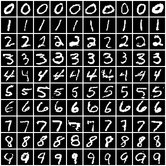
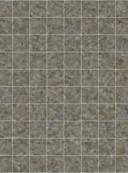

# Drifting Model

Unofficial PyTorch implementation of ['Generative Modeling via Drifting'](https://arxiv.org/abs/2602.04770). Inspired by <https://github.com/tyfeld/drifting-model>.

This repo supports drifting training with both **Pixel-space Generation** and **Latent-space Generation** with **SSL Feature Extractor**.

**Note:** THIS IS NOT AN OFFICIAL REPO. The code is still under development and may contain bugs or incomplete features. Please refer to the [original paper](https://arxiv.org/abs/2602.04770) for the canonical implementation and results.

## Guides

- [Installation](#installation)
- [Quick Start](#quick-start)
- [Workflow](#workflow)

## Installation

1. Clone the repo:

    ```bash
    git clone https://github.com/shentan-shiina/drifting_re.git
    cd drifting_re
    ```

2. Setup virtual environment and install dependencies:

    ```bash
    # setup env with any package manager you prefer
    uv venv .venv --python 3.12
    source .venv/bin/activate

    # Install dependencies
    uv pip install --python .venv/bin/python -r requirements.txt --extra-index-url https://download.pytorch.org/whl/cu128 --index-strategy unsafe-best-match

    # Install repo
    uv pip install --python .venv/bin/python -e .
    ```

3. Modify config paths in `drifting/config/config.yaml`, as well as the custom dataset configs under `drifting/config/dataset/` if needed.

**Note:** You might need versions of `torch==2.9.1`, `torchvision==0.24.1`, and `lightning==2.6.1` that are compatible with your CUDA and hardware.

## Quick Start

A quick tutorial on training a pixel-space drifting model w/o feature encoder on MNIST.

Precompute FID stats:

```bash
python drifting/scripts/prepare_dataset.py dataset.name=mnist \
                                           compute_fid=True \
                                           compute_latent=False
```

Train a tiny DiT with drifting:

```bash
python drifting/scripts/train_driftdit.py dataset.name=mnist \
                                           dataset.model=DriftDiT-Tiny \
                                           dataset.use_latent=False \
                                           dataset.use_feature_encoder=False \
                                           dataset.samples_per_class=8 \
                                           dataset.batch_n_pos=32 \
                                           dataset.batch_n_neg=32 \ 
                                           dataset.epochs=20 \
                                           batch_size=256
# You may lower batch_n_pos and batch_n_neg for smaller VRAM
```

Sample and compute FID:

```bash
python drifting/scripts/sample.py dataset.name=mnist \
                                  dataset.model=DriftDiT-Tiny \
                                  dataset.use_latent=False \
                                  dataset.use_feature_encoder=False \
                                  checkpoint=/path/to/last.ckpt \
                                  samples.compute_fid=True
```

You should get generated image grids under `outputs/mnist/.../samples/` like this with larger epochs:



MNIST is just too small for latent-space training, but you may still try using the SD-VAE latents by scaling up MNIST image size to 128x128, then train the model on 16x16 latents. The training iterations would be like this:



## Workflow

To properly train a drifting model with different setups, follow these steps in order.

### Step 1: Pre-compute Latents and FID Stats

```bash
python drifting/scripts/prepare_dataset.py dataset.name=imagenet \
                                           compute_fid=True \
                                           compute_latent=True
```

Generated latents and FID stats will be saved under `./outputs/mnist/`.

### Step 2: Pre-train the Feature Encoder

Train a feature encoder for feature-space drifting. We only implement MAE pre-training for now, but you can easily add other SSL methods.

```bash
python drifting/scripts/train_mae.py dataset.name=imagenet \
                                    dataset.use_latent=true \
                                    dataset.mae.epochs=100 \
                                    dataset.mae.finetune_classifier=true

```

### Step 3: Train the Drifting Model

Train the main generative model. Modify detailed training configs in `config.yaml` and the dataset-specific config under `config/dataset/` if needed.

```bash
python drifting/scripts/train_driftdit.py dataset.name=imagenet \
                                          dataset.use_latent=true \
                                          dataset.use_feature_encoder=true \
                                          dataset.epochs=2000 \
                                          dataset.batch_n_pos=64 \
                                          dataset.batch_n_neg=64 \
```

### Step 4: Sample and Evaluate

Generate image grids, alpha-sweep interpolations, and calculate the FID score using the precomputed FID stats.

```bash
python drifting/scripts/sample.py dataset.name=imagenet \
                                  samples.num_samples=10000 \
                                  samples.samples_per_class=10 \
                                  samples.compute_fid=true \
                                  checkpoint=/path/to/best.ckpt \
```
